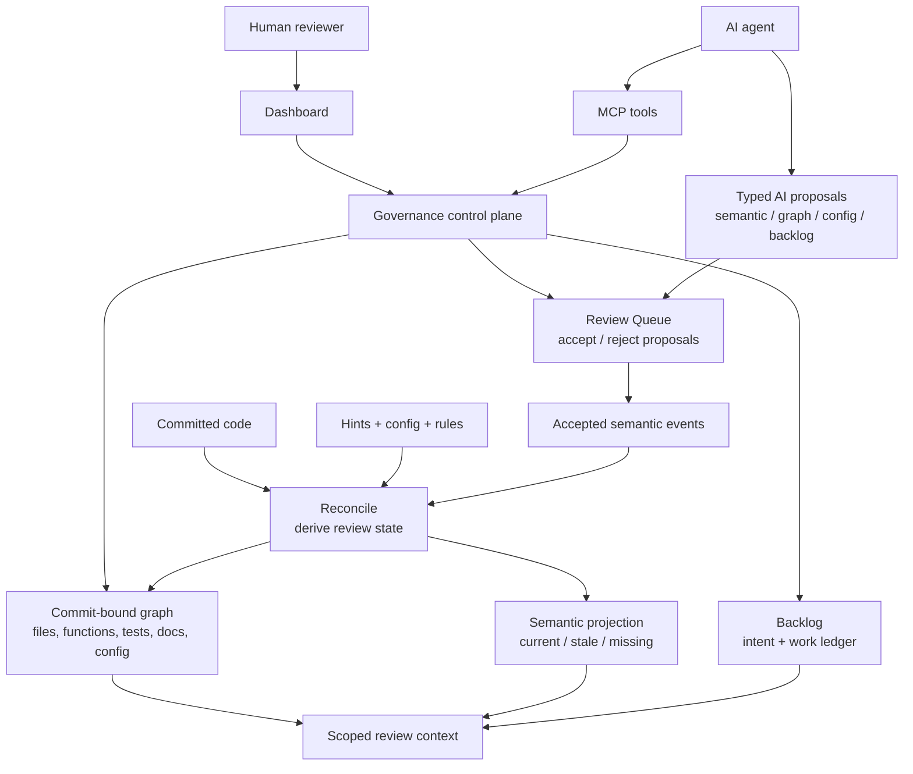
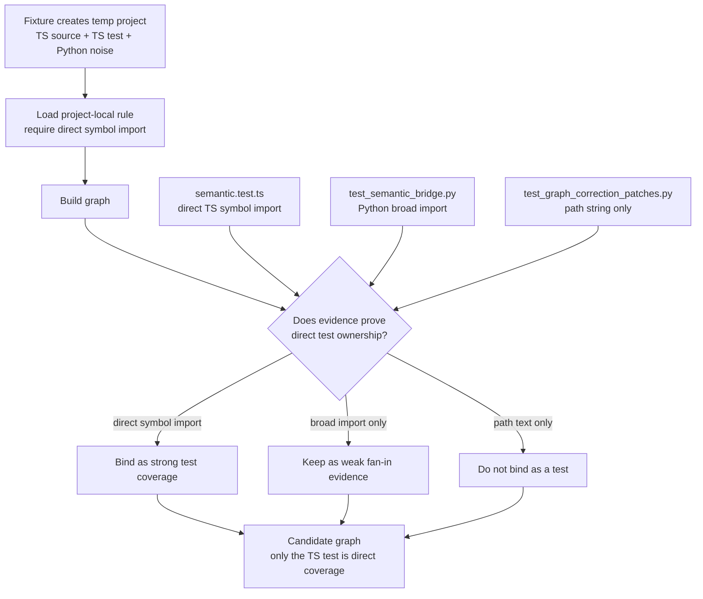

# Aming Claw

**Your AI agent and you, sharing the same dashboard.**

Open source workspace for AI-coded development. See what AI is touching in
real-time, audit every change, review proposals before they land in your
codebase. Multi-language (Python/TypeScript), MCP-native, local-first.


## AI-Agent Review Control Plane

Aming Claw is a graph-governed control plane for AI-agent code review. The
claim is narrow: not total program correctness, not human-free review, and not
free first-build cost on huge monorepos. The V1 loop is a reusable project fact
layer: commit-bound graph state, typed AI proposals, review gates, durable
repair rules, and reconcile after code or rules change.



The important boundary: AI proposals are not trusted state. Committed code,
source-controlled hints/config/rules, and accepted semantic events are source;
graph snapshots, semantic projections, review queues, and test/doc/config
bindings are derived state.

## Contents

- [Get Started](#get-started)
- [HN Demo](#hn-demo)
- [Review-Scope Challenge](#review-scope-challenge)
- [Key Terms](#key-terms)
- [Architecture Contracts](#architecture-contracts)
- [Demos](#demos)
- [Dashboard Surfaces](#dashboard-surfaces)
- [Use Cases](#use-cases)
- [Observer-Led Manual Fix](#observer-led-manual-fix)
- [V1 MVP Snapshot](#v1-mvp-snapshot)
- [Install Details](#install-details)
- [Runtime Boundaries](#runtime-boundaries)
- [Plugin Components](#plugin-components)
- [Workflow](#workflow)
- [CLI](#cli)
- [Packaging](#packaging)
- [Governance Contract](#governance-contract)
- [Deep Dive](#deep-dive)
- [Status & Contributing](#status--contributing)
- [Documentation](#documentation)
- [License](#license)

## Get Started

Start with the AI host you use. The longer requirements, raw installer commands,
and troubleshooting notes are in [Install Details](#install-details).

### Codex

Ask Codex for the complete one-shot path. This installs the plugin/runtime,
starts local governance, and opens the dashboard:

```text
One-shot install and open dashboard for Aming Claw from https://github.com/amingclawdev/aming-claw
```

If you only want to refresh the local plugin package, use the install-only
command instead. Install-only does not start the long-running governance service
and does not open the dashboard:

```bash
aming-claw plugin install https://github.com/amingclawdev/aming-claw
```

Reload Codex or open a new Codex session after install. First-run startup and
verification steps are in [Install Details](#install-details).

### Claude Code

Paste this once — Claude bootstraps the plugin end-to-end:

```text
Install aming-claw end-to-end from https://github.com/amingclawdev/aming-claw:
1. Run `/plugin marketplace add https://github.com/amingclawdev/aming-claw`
2. Run `/plugin install aming-claw@aming-claw-local`
3. pip install -e the marketplace clone at
   ~/.claude/plugins/marketplaces/aming-claw-local
   (Windows: %USERPROFILE%\.claude\plugins\marketplaces\aming-claw-local)
4. Start `aming-claw start` in a background terminal
5. Run `aming-claw open` to launch the dashboard
6. Remind me to reload Claude Code so the plugin's MCP tools and skills load
```

Steps 1–2 only copy the skill files; pip install adds the Python runtime,
`aming-claw start` boots the local governance service, and `aming-claw open`
launches the dashboard. After reloading, phrases like "install and start
aming-claw" or "one-shot install" trigger the launcher skill's one-shot
mode for re-bootstrap in future sessions. First-run troubleshooting and
raw installer scripts are in [Install Details](#install-details).

### After installation: open a new Claude Code session

The Claude Code session you installed Aming Claw in **won't** load the plugin's
skills or MCP tools — Claude Code reads plugin paths at session start, so
changes apply only to **new** sessions.

**Works immediately (no new session needed):**

- The `aming-claw` CLI on your `PATH`
- `aming-claw start` brings up local governance
- `aming-claw open` launches the dashboard

**Requires a new session:**

- The `/aming-claw:aming-claw`, `/aming-claw:aming-claw-launcher`, and
  `/aming-claw:aming-claw-hn-challenge` / `/aming-claw:aming-claw-hn-demo*`
  skills
- The `mcp__plugin_aming-claw_aming-claw__*` MCP tools (`health`,
  `runtime_status`, `task_*`, `backlog_*`, `graph_*`, etc.)

> **TL;DR**: After install, open a new Claude Code session to use Aming Claw
> *inside* your Claude Code conversations. The dashboard works in the current
> session.

This is a Claude Code framework behavior, not specific to Aming Claw — but it
surprises users often enough that we call it out.

## HN Demo

The HN demo article starts here:
[Show HN: Aming Claw - A new multi-agent coding architecture (zero
orchestration, commit-bound)](docs/hn-demo/article.md).

The runnable demo is the multi-agent challenge:
[HN Multi-Agent Challenge Demo](docs/hn-demo/README.md). It shows one observer
coordinating two contracted workers against the same commit-bound project graph:
one worker passes, one fails or is interrupted, the observer replays the failed
worker from the same contract lineage, and accepted work reconciles once against
the target graph.

More cases, audit trails, and the longer design story are here:
[Hope is not an engineering control for AI coding agents](docs/hn-demo/design-story.md).

After installing the plugin and opening a new AI host session, invoke the HN
challenge skill:

```text
Use this current Claude Code or Codex session as the observer for the Aming
Claw HN challenge.

/aming-claw:aming-claw-hn-challenge

Do not treat any scripted runner as proof that an AI observer ran. Use fixture
scripts only to create an isolated project if needed. Produce the backlog rows,
timeline events, graph traces, worker fences, tests, replay evidence, reconcile
evidence, and semantic evaluation from this current session.
```

The skill should produce a generated audit report with dashboard URLs and a
same-observer evaluation. It should not treat pre-existing fixture data or a
script runner label as proof.

First-run users do not need an existing `project_id`. The fixture helper creates
an isolated local fixture under the OS temp directory, bootstraps it as
`aming-claw-hn-demo`, and leaves the observer to create evidence during the run
without touching the current app. The helper is packaged with the plugin, so
this setup helper does not require a dashboard npm install. It is not the
preferred demo path by itself; the current Claude/Codex session still runs the
observer flow:

```bash
node frontend/dashboard/scripts/e2e-hn-demo.mjs --ensure-fixture --no-browser
```

For repository dogfood screenshots, pass the real project explicitly:
`cd frontend/dashboard && npm run e2e:hn-demo -- --project aming-claw`.

## Everyday AI Coding Demos

These demos are for ordinary vibe-coding users. They avoid audit-heavy language
and show the day-to-day problems people hit while working with AI agents:

- **Keep talking while agents work**:
  [Vibe Queue Demo](docs/vibe-queue-demo/README.md). You keep describing
  requirements while the observer turns confirmed items into backlog rows,
  dispatches compatible work in parallel, and lands commits serially.

The preferred path: install Aming Claw, open a fresh Claude Code or Codex
session, and let that current session act as the observer. The packaged
fixture/audit scripts are for setup and Docker release checks; they are not a
substitute for the live observer path.

## Review-Scope Challenge

This regression case is a small local E2E. The fixture creates a temporary
project with one TypeScript source file, one real TypeScript test, and two
Python files that look related but should not become direct test coverage. The
temporary project writes its own `.aming-claw/reconcile/semantic_enrichment.yaml`
rule for test fan-in, then builds the graph and verifies the resulting review
scope. The test also points `RECONCILE_SEMANTIC_CONFIG` at an isolated base with
no graph-enrich rules, so the result must come from the temporary project's
local rule rather than Aming Claw's repository config.



```bash
PYTEST_DISABLE_PLUGIN_AUTOLOAD=1 pytest -q agent/tests/test_phase_z_v2_pr3.py::TestCoverageLookup::test_graph_enrich_config_downgrades_cross_language_test_fanin_without_direct_symbol
```

Expected behavior:

- `frontend/dashboard/src/lib/semantic.test.ts` remains strong test coverage
  because it directly imports the TypeScript symbol.
- `agent/tests/test_semantic_bridge.py` is retained as weak fan-in evidence,
  not direct coverage.
- `agent/tests/test_graph_correction_patches.py` does not become a direct test
  for `frontend/dashboard/src/types.ts` just because it mentions the path.

The dogfood path that produced this case also involved AI semantic review and a
Review Queue proposal. This fast challenge avoids requiring an AI provider; it
tests the replayable graph/rule behavior directly.

The actual story was: AI semantic review noticed suspicious review context,
the proposed graph-enrich config stayed queued for observer review instead of
mutating state, an observer session checked graph evidence, then the durable
fix became a project-local rule plus regression fixture. That is the
control-plane claim in miniature.

The point is not that this finds every bug. The point is that review context
can be explicit, replayable, gated, auditable, and maintained incrementally
instead of guessed from each diff.

## Key Terms

- **Commit-bound graph** — graph state pinned 1:1 to a specific git commit; queries return what was true at that commit. The snapshot id encodes the commit (e.g. `scope-aefef99-a554`).
- **Manual Fix (MF)** — the audit-trailed change workflow: predeclare a backlog row → graph-first discovery → scoped edit → focused tests → commit with Chain trailers → graph reconcile → close the row. V1's default implementation path in place of chain automation.
- **Observer session** — an Aming Claw-enabled AI session operating for the user. It uses MCP tools, local checks, graph traces, and backlog rows so the user can ask for governed work in natural language rather than running every command manually.
- **Update Graph / scope reconcile** — re-materialize the graph snapshot to track new commits. Triggered after a Manual Fix lands so subsequent queries see the latest code.
- **Operations Queue** — dashboard view of in-flight graph operations: snapshot builds, semantic enrichment jobs, reconcile work, governance hint patches.
- **Review Queue** — dashboard view where AI-proposed semantic memories wait for human accept/reject; nothing becomes trusted project memory until an operator approves.
- **Semantic projection** — derived semantic memory for the active graph snapshot. Accepted semantic events are source; the projection is the current materialized view.
- **Doc asset state** — commit-bound inventory of documentation files, their
  hashes, and binding status. Weak matches remain `candidate`; only accepted
  graph bindings enter impact scope.
- **Typed proposal** — AI output submitted as machine-checkable workflow input. Proposals are routed through schema/precheck, policy, review, and reconcile paths before anything becomes trusted state.
- **Self graph bundle** — packaged read-only Aming Claw graph/semantic context used by fresh plugin sessions before the Aming Claw repo bootstraps itself as a governed project. The sealed bundle includes a curated structure read model, function index, hashes, and accepted node semantic projection; it does not import raw governance DB state.
- **Source-Controlled Hints** — reviewed comment metadata written into tracked files, then materialized by reconcile after commit plus Update Graph. V1 uses this contract for two graph repairs: binding orphan doc/test/config files to existing nodes, and topology fixes such as `add_edge`, `suppress_edge`, and `move_file`. Deleting the hint withdraws the projected effect.
- **AI Enrich** — request the AI provider to generate a semantic summary/intent/risk for selected nodes or edges. Proposals land in Review Queue; the AI provider is the local `claude` or `codex` CLI (see [AI Providers](#ai-providers)).

## Architecture Contracts

**Source vs derived state.** Committed code, source-controlled hints/config/rules,
and accepted semantic events are source. Graph snapshots, semantic projections,
review queues, and materialized test/doc/config bindings are derived by
reconcile. AI proposals are never trusted state by themselves. Graph defects are
fixed by adding, updating, or removing source-controlled hints/config/rules and
then reconciling, not by editing the graph database as trusted state.

**Proposal before mutation.** AI does not directly edit graph topology or
semantic memory. It submits typed proposals such as semantic updates, graph
corrections, config changes, asset-binding proposals, or backlog items.
Governance routes each proposal through the relevant precheck, policy gate,
Review Queue, and reconcile path. Weak doc/test/config evidence such as path
mentions, import-only references, semantic summaries, or downgraded weak test
fan-in stays as reviewable proposal evidence; it does not become trusted graph
binding until a reviewed hint/rule/decision or direct symbol evidence exists.
Documentation is tracked as an atomic commit-bound asset first: reconcile writes
`doc-asset-state.json` with path/hash/status/candidate evidence, and impact
scope consumes accepted bindings only.

Example proposal shape:

```json
{
  "kind": "graph_enrich_config",
  "target": "tests edge",
  "evidence": ["cross-language path mention", "no direct TypeScript symbol import"],
  "operation": "downgrade_to_weak_tests",
  "precheck": "passed"
}
```

For machine-consumed AI output, prompts expose a local precheck and tell the
model to validate and repair its own draft once before final output. The server
gate is still authoritative. MCP graph queries also produce trace ids, so an
observer or subagent's project-context lookups can be audited instead of being
hidden inside chat history.

**Cost model.** The first full graph build is heavier than grep, especially on
large repositories. That is the tradeoff for a reusable project fact layer.
Steady-state work uses commit-bound incremental reconcile to update changed
files/functions, affected edges, semantic current/stale status, and review
queues.

**V1 boundary.** The V1 proof is the graph/backlog/Review Queue/reconcile loop.
Chain automation, gateway surfaces, Redis, and dbservice-backed memory are
advanced or experimental paths, not required for the local dashboard/graph MVP.

## Demos

Recorded clips of the V1 workflows.

### Install and verify


URL drop → `aming-claw plugin doctor` → `aming-claw start` → open `/dashboard`.

### Bootstrap a project


Choose a clean project, review exclude paths, build the graph, watch nodes
appear in Projects/Graph.

The Projects bootstrap form asks you to confirm which path prefixes should not
enter the graph. Defaults cover common folders such as `node_modules`, `dist`,
`build`, `.expo`, `.next`, and `coverage`, but project-specific names such as
`node`, `vendor`, local model checkouts, generated SDKs, scratch worktrees, or
fixture clones should be added before the first graph build.

### Inspect code through the graph


Select a node, open Files / Functions / Relations, jump to a function line in the editor.

### Resolve a graph-backed backlog row


Open an existing backlog row, inspect its target files and graph evidence, run
an observer-led Manual Fix, then close the row as `FIXED` with evidence.

### AI Enrich review


Run targeted AI Enrich, watch Operations Queue, then accept or reject the Review Queue proposal.

### Governance Hint


This clip shows the file-binding surface: bind an orphan doc/test/config file
to a node, commit the source-controlled hint, run Update Graph. Before that
hint lands, documentation path matches remain proposal/candidate evidence in
doc asset state rather than trusted impact scope. The same source -> commit ->
reconcile contract also covers reviewed topology repairs: `add_edge`,
`suppress_edge`, and `move_file`.

## Dashboard Surfaces

The dashboard is the shared panel for the human and the AI session. The user
can inspect the same evidence the observer is using through:

- **Projects** - register/select workspaces and see graph bootstrap state.
- **Graph** - browse node hierarchy, files, tests, docs, config, relations, and
  function indexes.
- **Inspector** - inspect selected node metadata, evidence, hashes, and source
  file bindings.
- **Operations Queue** - watch snapshot builds, semantic jobs, reconcile work,
  graph-enrich/config proposals, and retryable operations.
- **Review Queue** - accept or reject AI-proposed semantic memory or graph/config
  follow-ups before they become trusted state.
- **Backlog** - keep requirements, defects, PR opportunities, MF rows, target
  files, and verification evidence in one local ledger.
- **AI Config** - configure project-level provider/model routing for AI Enrich.

## Use Cases

### Govern AI-assisted fixes

For V1, ask an observer session to use Manual Fix rather than chain automation
for normal implementation. The user-facing interaction can be one sentence:

```text
Use Manual Fix for this issue: file or update backlog first, check graph impact,
implement the scoped change, run focused tests, then report evidence.
```

The observer handles the MCP calls and local checks: backlog first, graph first,
scoped edits, focused tests, `preflight_check` when MCP is available, then a
reviewable summary. Commit, reconcile, and backlog close can wait for explicit
user approval.

### Hand off work between AI agents

Use graph, backlog, queue state, and commit evidence as the shared project
ledger between Codex, Claude Code, and future agent workers. One AI can file a
backlog row, another can inspect the same graph evidence, implement a scoped
fix, and a third can review or continue the task without depending on fragile
chat history. Parallel worker coordination is still an advanced path, but the
contract is already there: backlog records intent, graph records structure and
state, and gates verify scoped output before it is trusted.

### Share the dashboard view with an AI agent

Keep the dashboard open while Codex or Claude Code uses MCP graph tools. The
human sees project health, graph structure, queue state, review proposals, and
backlog; the AI uses the same evidence to explain and act.

### Find credible PR opportunities

Use the graph to inspect unknown open-source projects, locate weak modules,
missing tests/docs, high fan-out functions, stale semantics, and isolated files.
Turn the evidence into backlog rows before implementing a focused PR.

### Review semantic memory before trusting it

Run AI Enrich on selected nodes or edges, then accept or reject the proposal in
Review Queue. `ai_complete` means the AI produced a proposal, not that the
project memory is trusted.

### Repair graph structure safely

Use Source-Controlled Hints for graph repairs: bind orphan doc/test/config files
to existing nodes, add a missing edge, suppress an incorrect inferred edge, or
move file ownership. Hints are written as source-controlled evidence and only
take effect after commit plus Update Graph. Removing the hint removes the
projected graph effect on the next reconcile.

Documentation binding is deliberately conservative. New docs can stay unbound
or candidate-bound in doc asset state until an AI/observer proposal is reviewed
or a source-controlled hint supplies durable evidence. That keeps orphan-state
auditing intact and prevents weak path mentions from silently expanding review
impact.

## Observer-Led Manual Fix

Manual Fix is not primarily a command sequence the user has to run. It is an
observer-led workflow that gives an AI session a strict operating contract.

User prompt:

```text
Use Manual Fix for this issue.
```

The observer session then:

1. Checks runtime, graph, operations queue, and relevant backlog state.
2. Files or updates the backlog row with target files and acceptance criteria.
3. Uses graph queries before editing so review scope is explicit.
4. Makes a scoped change without reverting unrelated user work.
5. Runs focused tests and local precommit/plugin checks when relevant.
6. Reports changed files, tests, remaining warnings, and whether commit/reconcile
   is still waiting for user approval.

The command line remains available for debugging and reproducibility, but the
product path is natural language to an Aming Claw-enabled observer.

## V1 MVP Snapshot

Aming Claw V1 is focused on one practical loop: help a human and an AI agent
understand a local project through a commit-bound graph, find credible PR
opportunities, record them in backlog, and execute small governed fixes.

Stable V1 capabilities:

- Register a target project explicitly, then build or update its local graph.
- Explore nodes, files, functions, docs, tests, relations, fan-in/fan-out, and
  bounded source excerpts through the dashboard or MCP graph tools.
- Use the dashboard as a shared visual control plane for the user and AI
  session.
- File backlog rows with graph evidence and use Manual Fix discipline for
  implementation work.
- Run targeted AI Enrich on selected nodes or edges, then accept or reject the
  proposed semantic memory in Review Queue.
- Use Source-Controlled Hints to repair graph bindings and topology through
  committed evidence plus reconcile.

V1 boundaries to keep visible:

- Chain dev/test/qa/merge automation is experimental. The recommended V1
  implementation path is Manual Fix with backlog-first, graph-first, tests,
  explicit commits, and Update Graph after commit.
- ServiceManager/executor are advanced chain/ops surfaces, not V1 first-run
  requirements. The stable V1 path is governance, dashboard, MCP, graph,
  backlog, Review Queue, and Manual Fix.
- Full semantic coverage is not required for V1. AI-generated semantics are
  proposals until reviewed and accepted.
- Function-level call queries exist for supported snapshots, but dashboard
  visualization is still evolving.
- Graph repair is not arbitrary graph database editing. V1 supports constrained,
  reviewed, source-controlled repairs: orphan file binding plus graph-structure
  hints for `add_edge`, `suppress_edge`, and `move_file`, all materialized by
  reconcile and reversible by source changes.
- Plugin install, governance startup, dashboard availability, MCP visibility,
  local AI CLI readiness, and optional chain/ops readiness are separate states.

Best-fit V1 use cases:

- Open-source contributors inspect unfamiliar projects through the graph, find
  evidence-backed improvement opportunities (missing tests/docs, high-coupling
  modules, stale semantics), and file focused PRs with graph-backed
  justification.
- AI agents use graph-first discovery instead of broad repository search when
  onboarding to an unfamiliar project.
- Maintainers use the dashboard to find missing tests/docs, high-coupling
  modules, stale semantics, and reviewable backlog items.
- A user and AI session share the same dashboard view while the AI performs
  MCP-backed graph, backlog, and semantic operations.

## Install Details

### First Run And Verify

Start governance in a separate terminal, then open the dashboard:

```bash
aming-claw start
aming-claw open
```

Run the read-only check when you want to confirm the local install:

```bash
aming-claw plugin doctor
```

`aming-claw start` only starts the local governance service. It does not prove
that Codex/Claude loaded the plugin, MCP tools, dashboard static files,
optional chain/executor services, or AI CLI auth.
`plugin doctor` checks V1 install/governance readiness by default. Add
`--check-service-manager` only when testing advanced chain/executor operations.

### Requirements

- Python 3.9+
- Git
- Node.js/npm when rebuilding the dashboard from source
- Codex or Claude Code as the plugin host (loads skill + MCP tools)
- A working `claude` and/or `codex` CLI on `PATH` — Aming Claw's AI features
  (AI Enrich, semantic review, chain handlers that spawn AI sub-tasks) shell
  out to the local CLI rather than calling Anthropic/OpenAI directly. See
  [AI Providers](#ai-providers) below.

### AI Providers

AI-driven features in Aming Claw **call the local Claude Code or Codex CLI as
a subprocess** — Aming Claw does not make direct API calls to Anthropic or
OpenAI. As a consequence:

- You need a working `claude` and/or `codex` executable on `PATH`. Override
  the path with `CLAUDE_BIN` / `CODEX_BIN` env vars if needed.
- The CLI must be **logged in**. Aming Claw probes `--version` to confirm the
  binary exists, but cannot verify auth — `runtime_status` / `plugin doctor`
  report `auth unknown` until a real model call succeeds.
- Each project's AI config must declare a `semantic` provider/model. `openai`
  routes use the Codex CLI; `anthropic` routes use the Claude Code CLI. AI
  Enrich is blocked if the semantic route is unset.
- `.env` `ANTHROPIC_API_KEY` / `OPENAI_API_KEY` are **not** consumed by AI
  Enrich — the local CLI's own auth is the source of truth.

If a CLI is missing or routing is unset, the dashboard's AI Enrich button
surfaces the specific reason (e.g., `missing`, `routing missing`); structural
graph queries, backlog, and Manual Fix still work without any AI CLI. See
[Runtime Boundaries](#runtime-boundaries) for the full state model.

If you are starting from Codex and want the full first-run experience, use the
one-shot prompt from [Get Started](#get-started):

```text
One-shot install and open dashboard for Aming Claw from https://github.com/amingclawdev/aming-claw
```

Plain plugin-install wording is install-only. It should install or refresh
plugin assets, but it should not start governance or open the dashboard:

```text
Install the Aming Claw plugin from https://github.com/amingclawdev/aming-claw
```

When you need the raw bootstrap script verbatim for Windows PowerShell or
macOS/Linux shells, see
[`docs/install/codex-bootstrap.md`](docs/install/codex-bootstrap.md).

### Claude Code install detail

In Claude Code, install from the Git URL:

```text
/plugin marketplace add https://github.com/amingclawdev/aming-claw
/plugin install aming-claw@aming-claw-local
```

Reload Claude Code or open a new session after install. Plugin install loads
plugin/skill assets and the MCP server declaration only — it does **not**
install Python dependencies, start governance, or prove MCP tools are visible
in the current session. To get a fully-working install (Python package + Codex
cache when relevant + doctor-verified), pair it with `aming-claw plugin
install <git-url>` from the CLI side, or use the clone fallback below if a
Claude Code sandbox blocks the remote URL.

If an older Aming Claw runtime is already installed, update the plugin checkout
directly:

```bash
aming-claw plugin install https://github.com/amingclawdev/aming-claw
aming-claw plugin doctor
```

If the host cannot install Git plugins directly yet, clone once and use the
repo-local package:

```bash
git clone https://github.com/amingclawdev/aming-claw.git
cd aming-claw
pip install -e .
```

Then start governance in a separate terminal and leave it running, then open
the dashboard:

```bash
aming-claw start
aming-claw open
```

If the `aming-claw` console script is not on `PATH` yet, run the same CLI
through Python: `python -m agent.cli start`.

After installing or updating the plugin, reload Codex or open a new Codex
session. Plugin load and governance startup are separate: `aming-claw start`
only starts the local governance service, while the Codex plugin/skill/MCP
must be loaded by Codex itself.

Run the read-only aftercare check when troubleshooting a fresh install:

```bash
aming-claw plugin doctor
```

Expected checks:

- `.codex-plugin/plugin.json` exists.
- `.agents/plugins/marketplace.json` contains `aming-claw`.
- Codex config enables `aming-claw@aming-claw-local`.
- Codex plugin cache contains
  `plugins/cache/aming-claw-local/aming-claw/<version>/.codex-plugin/plugin.json`.
- The generated Codex marketplace path is valid. A repo-local marketplace file
  may be reported as a compatibility warning; real Codex CLI loading uses the
  installed cache plus generated marketplace/config.
- `.claude-plugin/marketplace.json` schema: `plugins[].source` starts with
  `"./"` and `metadata.description` is present (`claude plugin validate`
  fails or warns otherwise).
- `.claude-plugin/plugin.json` schema: `name` + `version` + `description`
  present; if `mcpServers` is declared, basic shape is checked (command +
  args).
- `.mcp.json` contains `mcpServers.aming-claw`.
- Dashboard static assets are present, or doctor prints the exact build fallback.
- The packaged self graph bundle manifest is readable, uses a supported
  `bundle_major`, and its listed resource checksums match.
- Local Codex/Claude CLI commands are detected when available; detection still
  reports AI auth as unknown.
- Governance health is reachable after services are started.
- The dashboard route responds when governance is running and static assets exist.
- A new Codex or Claude Code session can see the Aming Claw skill and MCP tools.

ServiceManager/executor health is intentionally not a default V1 doctor gate;
check it only when exercising advanced chain automation or host redeploy flows.
For Claude Code, use `claude mcp list` or an actual new-session tool check for
MCP visibility. `claude plugin details` may show `MCP servers (0)` even when the
plugin-declared server connects successfully.

Open the local launcher or dashboard:

```bash
aming-claw launcher --open-browser
aming-claw open
```

The root path is not the dashboard and may return `404`. If governance health
is OK but the dashboard route is unavailable, governance is up but dashboard
static assets are missing. No build is needed when either
`agent/governance/dashboard_dist/index.html` or
`frontend/dashboard/dist/index.html` exists. For a raw checkout missing both:

```bash
cd frontend/dashboard
npm install
npm run build
```

## Runtime Boundaries

Keep these states separate when troubleshooting:

- Plugin assets installed on disk.
- Codex or Claude Code loaded the skill/MCP in the current session.
- Governance health is reachable.
- Dashboard static assets are present and the dashboard route responds.
- Local AI CLIs are detected and the project has AI routing.
- Packaged self graph bundle compatibility is current for the installed runtime.
- Optional advanced chain/ops readiness: ServiceManager on port `40101` and
  executor/chain automation.

`aming-claw start` only starts governance. It does not prove the current
Codex/Claude session loaded the plugin, that dashboard assets exist, that
optional ServiceManager/executor chain automation is online, or that
Codex/Claude CLI auth is valid.
Reload/open a new editor session after installing or updating plugin assets.

Aming Claw is local-first. The governance DB, backlog, graph snapshots, review
queues, and plugin update state live on the user's machine. AI features use the
user's local `claude` or `codex` CLI; graph query, backlog, dashboard, and MF
workflows still run without an AI provider.

## Plugin Components

Aming Claw ships these assets in the repo:

- `.codex-plugin/plugin.json` + `.agents/plugins/marketplace.json` — Codex plugin + local marketplace
- `.claude-plugin/plugin.json` + `.claude-plugin/marketplace.json` — Claude plugin + local marketplace
- `.mcp.json` — MCP server contract (read when the repo is opened as a workspace; the CLI installer also generates cache-aware overrides for plugin-mode loading)
- `skills/aming-claw/` — main governance skill
- `skills/aming-claw-launcher/` — onboarding/launcher skill
- `skills/aming-claw-hn-challenge/` — public HN multi-agent challenge skill
- `skills/aming-claw-hn-demo*/` — compatibility and supporting case walkthrough skills
- `skills/aming-claw-vibe-queue-demo/` — everyday demo for keeping requirement
  conversation flowing while agents work
- `agent/mcp/resources/seed-graph-summary.json` — lightweight packaged context
  for fresh sessions
- `agent/mcp/resources/self-graph-bundle-manifest.json` — read-only compatibility
  manifest for packaged self graph/semantic context
- `agent/mcp/resources/self-graph-bundle/` — sealed structure and semantic
  projection resources for fresh-session orientation and smoke checks

After install, the plugin exposes these skills (Claude Code namespacing shown):

- `/aming-claw:aming-claw`
- `/aming-claw:aming-claw-launcher`
- `/aming-claw:aming-claw-hn-challenge`
- `/aming-claw:aming-claw-hn-demo`
- `/aming-claw:aming-claw-hn-demo-before-work`
- `/aming-claw:aming-claw-hn-demo-during-work`
- `/aming-claw:aming-claw-hn-demo-after-work`
- `/aming-claw:aming-claw-vibe-queue-demo`

### What `aming-claw plugin install` writes

The CLI installer (`aming-claw plugin install <git-url>` or
`python scripts/install_from_git.py <git-url>`) is not just a `git clone`:

- Clones/updates the plugin checkout under `~/.aming-claw/plugins/<slug>`.
- Installs the Python package (`pip install -e .`) so the CLI and MCP server
  are importable.
- Writes Codex config + a generated local marketplace + a versioned plugin
  cache at `~/.codex/plugins/cache/aming-claw-local/aming-claw/<version>/`
  that real Codex CLI startup reads.
- Does not write plugin-owned files into the target project you are governing.
  If a target project contains `.mcp.json` with `--project aming-claw`,
  `.codex-plugin/`, `.claude-plugin/`, `.agents/plugins/`, or
  `shared-volume/codex-tasks/`, treat it as install/startup pollution and
  remove it before bootstrap.

Run `aming-claw plugin doctor` after install. If the cache or generated
marketplace is missing/inconsistent, doctor reports `fail` (not just `ok`).
A passing doctor verifies the on-disk install and generated config; still open
or reload a Codex/Claude session and confirm the skill/MCP tools are visible.
Use `aming-claw plugin update --check` to fetch the configured Git remote,
compare the installed checkout with the remote commit, and refresh the local
plugin update state. Use `aming-claw plugin update --apply` to fast-forward the
checkout, refresh the Python/Codex install surfaces, and write restart/reload
obligations for MCP, governance, or advanced ServiceManager/chain surfaces when
changed files require operator action. After completing those restarts/reloads,
run
`aming-claw plugin update --check` again to mark the installed commit current.

Plugin update state is intentionally explicit:

- `current` - installed checkout matches the checked remote commit.
- `available` - a newer remote commit exists; apply when ready.
- `applied_pending_restart` - files changed that require MCP, governance, or
  advanced ServiceManager/chain reload before the new runtime is fully in use.
- `failed` - the last update attempt failed and should block MF precommit.
- missing state - warning only; run `aming-claw plugin update --check` when you
  want a fresh remote comparison.

The self graph bundle has its own compatibility check. The installed runtime
supports a `bundle_major`; if a packaged bundle declares a higher major, local
checks fail and emit a structured `plugin_update_reminder` event instead of
silently importing context the runtime may not understand.

```bash
python scripts/check_self_graph_bundle.py --json-output
```

The current sealed bundle exposes:

- `aming-claw://self-graph-bundle/graph-structure` — portable graph structure,
  file bindings, function lines, and function hashes.
- `aming-claw://self-graph-bundle/semantic-projection` — accepted node semantic
  memory for the sealed snapshot.
- `aming-claw://self-graph-bundle/manifest` — repo-local copy of the manifest
  that ties the resources to one commit, snapshot, and projection.

The bundle is read-only context. It is trusted as a replayable projection from
committed code, source-controlled hints/config/rules, accepted semantic events,
and reconcile output; it is not a governance DB import and it intentionally
does not claim unfinished edge semantics are complete.

Starting governance is a separate long-running service command; keep it in its
own terminal instead of expecting plugin install to start it. On Windows use a
separate shell such as `Start-Process powershell`; on macOS/Linux a detached
smoke command can use `nohup python3 -m agent.cli start`.

### Post-Install Verification

In a new Codex or Claude Code session, ask the AI to use the Aming Claw skill:

```text
Use the Aming Claw skill. Check runtime_status(project_id="<id>"), graph_status, and backlog before changing code.
```

Confirm visibility:

- Skills `/aming-claw:aming-claw` and `/aming-claw:aming-claw-launcher` resolve.
- MCP tool `mcp__aming_claw__health` returns `ok`.
- `runtime_status` reports core governance/version state and separates optional
  chain/ops readiness when ServiceManager/executor are present.
- MCP resource `aming-claw://self-graph-bundle-manifest` is readable when the
  plugin session needs packaged Aming Claw self-context.

Plugin install loads plugin/skill assets and the MCP server declaration; it
does not install Python dependencies (unless using the CLI installer above),
start governance, or validate AI CLI auth. Start governance separately with
`aming-claw start`. See [Runtime Boundaries](#runtime-boundaries) for the full
state model.

If a Claude Code sandbox blocks the remote installer script path, use the clone
fallback from [Install Details](#install-details) — that's an environment policy,
not a governance failure.

## Workflow

1. Clone and install Aming Claw.
2. Start the local governance service.
3. Load the Codex or Claude Code plugin.
4. Bootstrap or select a project in the dashboard.
5. Build or update the project graph.
6. Inspect nodes, files, functions, docs, tests, and relations.
7. Use AI Enrich on selected nodes or edges.
8. Review and accept or reject proposed semantic memory.
9. File backlog rows and PR opportunities with graph evidence.

Backlog rows are local governance memory. A plugin install or Git update does
not sync backlog rows across machines; it only updates code/plugin assets. Move
backlog evidence explicitly with a portable JSON export:

```bash
aming-claw backlog export --project-id <id> --output backlog.json
aming-claw backlog import --project-id <id> --input backlog.json
```

Import defaults to `--on-conflict skip`, so existing bug ids on the target
machine are not overwritten. Use `--dry-run` to preview the insert/update/skip
counts, or `--on-conflict overwrite` when the export should replace target
rows.

Backlog list queries are compact by default through MCP (`backlog_list` returns
`OPEN` rows with `limit=50`). For large imported backlogs, page through results
with `limit`/`offset`, search with `q`, and use `backlog_get` when a single row
needs full details. The HTTP list endpoint keeps its legacy full response for
no-query calls, but supports `view=compact`, `limit`, `offset`,
`include_closed`, `status`, and `priority`.

Project bootstrap is explicit. Do not silently register a workspace just
because the projects registry is empty. Bootstrap writes Aming Claw registry/DB
state, scans the workspace, and builds a commit-bound graph snapshot through
the governance project-bootstrap API; ServiceManager is not the bootstrap API.
If the target workspace is a dirty git repo, commit/stash first.

Install/startup state belongs to the plugin/runtime checkout, not the target
project. Bootstrap now refuses obvious Aming Claw self-artifacts in an external
target, such as `.mcp.json` pointing at `--project aming-claw` or
`shared-volume/codex-tasks/`. Clean those paths up or choose the real project
root before building the graph.

Before bootstrap, the dashboard asks the operator to confirm the path prefixes
that should be excluded from graph scanning. The defaults handle common
generated folders, but the operator must catch project-local names such as
`node`, `vendor`, generated clients, embedded example repos, temporary
worktrees, and large downloaded assets. Those reviewed paths are passed into
bootstrap as graph excludes. Source-controlled projects can also keep the same
contract in `.aming-claw.yaml` under `graph.exclude_paths`,
`graph.ignore_globs`, or `graph.nested_projects`; otherwise unwanted folders
may be materialized as real nodes and pollute review context until the project
is reconfigured and rebuilt.

For Aming Claw internals, an active local `project_id="aming-claw"` graph is not
required for the plugin to be usable. Use `aming-claw://seed-graph-summary` as
the compact packaged navigation map when no active self graph exists. Use
`aming-claw://self-graph-bundle-manifest`,
`aming-claw://self-graph-bundle/graph-structure`, and
`aming-claw://self-graph-bundle/semantic-projection` to inspect the sealed
self-context bundle. Target/user projects need bootstrap before graph-backed
claims are available.

## CLI

```bash
aming-claw launcher        # write/open the local launcher
aming-claw plugin install  # clone/update local plugin assets from Git
aming-claw plugin update --check # check Git remote and refresh update state
aming-claw plugin update --apply # fast-forward plugin checkout and write restart obligations
aming-claw backlog export --project-id <id> --output backlog.json
aming-claw backlog import --project-id <id> --input backlog.json --dry-run
aming-claw start           # start governance locally
aming-claw open            # open the dashboard
aming-claw status          # check governance health
aming-claw bootstrap       # register a project workspace
aming-claw scan            # scan an external project
```

Repo-local diagnostic helper:

```bash
python scripts/check_self_graph_bundle.py --json-output
python scripts/export_self_graph_bundle.py --snapshot-dir <snapshot-dir> --snapshot-id <snapshot-id> --projection-id <projection-id> --event-watermark <n>
python -m agent.cli mf precommit-check --json-output
```

## Packaging

For MVP distribution, use Git rather than PyPI:

```bash
git clone https://github.com/amingclawdev/aming-claw.git
cd aming-claw
pip install -e .
```

For an already-installed Aming Claw CLI, refresh a user-local plugin checkout
from Git:

```bash
aming-claw plugin install https://github.com/amingclawdev/aming-claw
```

For a cloned checkout before the console script is on `PATH`, run the installer
through Python:

```bash
python scripts/install_from_git.py https://github.com/amingclawdev/aming-claw
```

Python-only installation from Git is also possible:

```bash
pip install git+https://github.com/amingclawdev/aming-claw.git
```

The Python-only path installs CLI entrypoints, but local plugin loading is
clearest from a cloned checkout because Codex and Claude Code need access to the
repo-local plugin manifests, skills, and `.mcp.json`.

Before publishing a release build, rebuild the dashboard assets:

```bash
npm --prefix frontend/dashboard run build
python scripts/check_self_graph_bundle.py --json-output
python scripts/build_package.py --skip-dashboard-build
```

## Governance Contract

When working on Aming Claw itself, follow the project governance contract:

1. Check runtime, graph, and queue state before implementation.
2. File or update a backlog row before mutating code, docs, config, dashboard
   assets, or runtime state.
3. Query the graph before creating new modules or changing behavior.
4. Follow `skills/aming-claw/references/mf-sop.md` for manual fixes.
5. Evaluate whether E2E evidence is needed for dashboard or graph behavior.

## Deep Dive

- [Architecture](docs/architecture.md)
- [Deployment](docs/deployment.md)
- [Roles](docs/roles/README.md)
- [Governance](docs/governance/README.md)
- [Configuration](docs/config/README.md)
- [API](docs/api/README.md)

## Status & Contributing

**Status**: V1 MVP. Verified end-to-end on both Codex and Claude Code (the
Claude `/plugin install` path was the most recent install-blocker, now fixed).
Stable for local multi-AI dev and governance workflows. Chain dev/test/qa/merge
automation and bulk AI semantic enrichment remain experimental — see
[V1 MVP Snapshot](#v1-mvp-snapshot).

**Bug reports / feature requests**:
https://github.com/amingclawdev/aming-claw/issues

**Plugin packaging deep-dive for contributors**: see
[`skills/aming-claw/references/plugin-packaging.md`](skills/aming-claw/references/plugin-packaging.md).

## Documentation

- [Architecture](docs/architecture.md)
- [Deployment](docs/deployment.md)
- [Governance Overview](docs/governance/README.md)
- [Configuration Reference](docs/config/README.md)
- [API Overview](docs/api/README.md)
- [Plugin Packaging Notes](skills/aming-claw/references/plugin-packaging.md)
- [Codex Bootstrap Scripts](docs/install/codex-bootstrap.md)

## License

Aming Claw is licensed under the Functional Source License, Version 1.1, MIT
Future License (FSL-1.1-MIT). See [LICENSE](LICENSE).
