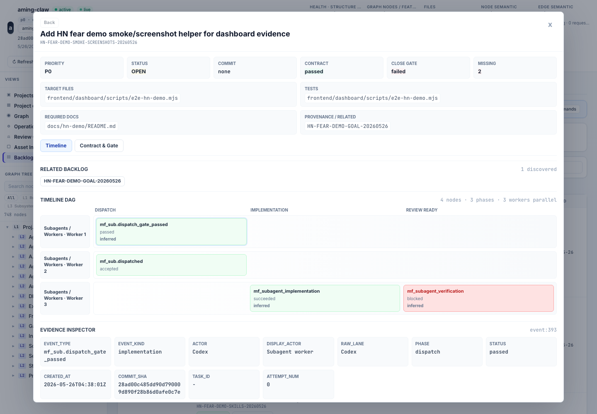

# Hope is not an engineering control for AI coding agents

Right now, when you ask an AI coding agent to ship a feature, you give it a
prompt and hope.

You hope it touched the right files. You hope it did not reimplement something
the project already had. You hope it ran the right tests. You hope it did not
break docs or config you forgot to mention. You hope the diff is actually what
you asked for.

Hope is not an engineering control. Aming Claw is my attempt to replace that
hope with contracts, evidence, and commit-bound project memory for AI coding
agents.

I have been building Aming Claw around a simple idea: an AI coding agent should
not just produce a diff. It should work against a contract, leave typed evidence,
and update the project facts that the next agent will read.

This article almost shipped with a quiet failure of exactly the kind I'm
describing: the demo screenshots in the README were out of sync with the actual
case pages. My own system caught it. I document the audit trail below.

The problem is not that agents use grep. Grep is fast, local, inspectable, and
honest. The problem is using grep, prompts, and chat history as the only memory
of a project.

Before unpacking those fears, the underlying bet:

> AI agents don't need bigger context windows. They need a persistent
> structural record of the project that survives across sessions.

I made that argument in an earlier essay. This article is what happened when I
tried to live with it -- and discovered that "persistent structural record"
alone doesn't survive contact with real multi-agent work. It splits into three
concrete fears, each needing its own kind of facts.

## A note on who operates this

Aming Claw is designed to be operated by AI, not by humans. The agent reads the
SKILL.md files, installs the plugin, runs the demo, writes contracts, queries the
graph, and produces evidence. The human reviewer reads the dashboard, reviews
the audit queue, and arbitrates disputes.

This inverts the usual developer-tool model. You don't learn Aming Claw -- your
agent does. What you learn is how to read what it produces: timelines,
contracts, evidence, drift state, reconcile status.

The bet underneath this: as agent autonomy increases, the bottleneck shifts from
"can the human use the tool" to "can the human see what the agent did." Aming
Claw is built for the second world.

Concretely: the eight or so concepts in this system -- contract, worker fence,
observer gate, graph projection, reconcile, asset binding, evidence timeline,
drift state -- are the protocol between you and your agent. The agent already
knows them from the skill files. You only need to recognize their visual forms on
the dashboard.

## The three fears

After six months of shipping with AI coding agents, the work splits cleanly
across three ordinary fears.

**Before work:** will the agent understand the project before it edits, or will
it duplicate an existing pattern and touch the wrong owner?

**During work:** can I see what the agent actually did, which files it owned,
which evidence it produced, and whether the work satisfied the contract?

**After work:** once the patch lands, do I know what changed in docs, tests,
config, generated assets, graph memory, and semantic memory before the next agent
trusts stale project state?

Those fears map to three kinds of project facts.

## Structural facts: before the edit

Structural facts describe what the project is.

Which files belong to which subsystem? Which functions call which functions?
Which docs, tests, config files, and assets are bound to a node? Which graph
snapshot was built from which commit? Is the active graph current, or is the
project asking the agent to reason from stale structure?

This matters because AI can make plausible architecture mistakes that are not
syntax errors.

One of my earlier failures was a service-pattern miss. A project already had a
standard HTTP service pattern, but the AI introduced a parallel WebSocket-style
service that looked coherent in isolation and wrong in context. The code could
compile. The problem was that the agent did not see the existing project shape
before writing.

Aming Claw treats the graph as a commit-bound projection of source, hints, config,
and accepted review events. The graph is not a mutable memory blob that the AI
edits directly. If the graph is wrong, the repair path is source-controlled
evidence or a reconcile run, not a silent database edit.

Case: [Fear Before Work](cases/before-work.md)

Architecture note:
[Before Work Architecture](architecture/before-work-architecture.md)

Related deeper story:
[AI proposed 5 components for my parallel system. After walking one scenario, only 3 were real.](https://dev.to/amingin_ai/ai-proposed-5-components-for-my-parallel-system-after-walking-one-scenario-only-3-were-real-12nd)

## Work facts: during the edit

Work facts describe what was promised.

What backlog row authorized the change? Which target files are in scope? Which
paths are forbidden? Which branch, worktree, fence token, source head, and
precheck belong to this worker? Which acceptance criteria are required before a
human can close the task?

Without work facts, an agent can be locally correct and globally destructive. It
can edit a sibling draft, clean up someone else's dirty file, or merge a branch
because its own final answer sounds confident.

In the Aming Claw V1 flow, a worker does not accept its own work. It can
implement, run checks, and append evidence. It cannot merge, close the backlog
row, or make branch-local graph state canonical. Observer review and machine
prechecks are separate state transitions.

This is the part I think of as contract-driven execution. The contract names the
work, target files, acceptance criteria, required evidence, and review boundary.
The execution timeline records dispatch, implementation, verification, and
close-ready events. The interesting part is not that a timeline exists. The
interesting part is that "I implemented it", "it passed verification", "it is
ready to merge", and "the backlog is closed" are different facts.

The workflow change I feel most in practice is observer mode. I can stay in
requirements and review mode while the agent turns decisions into contracts,
tightens boundaries, and dispatches bounded workers in parallel instead of
waiting for one task to finish before I can think about the next one. The agents
do execution work. The human reviewer keeps merge authority through the observer
gate.

The graph policy matters here. A branch graph is not project truth. A worker can
produce one-hop candidate evidence against the target commit, but it cannot chain
graph reconcile from its own branch, activate a branch-local projection, or carry
that projection into another branch. The target ref's graph remains the only
canonical project memory. After an ordered merge lands, the target ref is
reconciled and the next graph snapshot becomes current.

Without that rule, parallel AI work creates multiple plausible versions of the
project in memory, not just multiple diffs in Git.

*A single backlog row shown as a timeline. Each node carries evidence fields
such as actor, phase, status, commit, and artifacts.*

Case: [Fear During Work](cases/during-work.md)

Architecture note:
[During Work Architecture](architecture/during-work-architecture.md)

Related deeper story:
[I told my AI to build a feature. Did it? I had no idea.](https://dev.to/amingin_ai/i-told-my-ai-to-build-a-feature-did-it-i-had-no-idea-1f1)

## Execution and project-memory facts: after the edit

Execution facts describe what actually happened.

Which graph queries ran? Which trace ids came back? Which tests passed? Which
commit landed? Which runtime version served the dashboard when verification ran?
Which docs, tests, config files, and generated assets changed, and are they
trusted project memory or just candidate evidence?

This is where a lot of AI work rots quietly. A diff can be correct while the
project's memory is not. A doc can mention a feature without being a trusted
governance record for that feature. A path match can be useful evidence without
being strong enough to enter review impact scope. A smoke test can pass while a
reader-facing case page still points at old screenshots.

That is why the after-work case separates source records from derived views:
committed files, source-controlled hints, config, accepted bindings, review
decisions, and timeline events are durable inputs; Asset Inbox rows, graph
snapshots, semantic projections, candidate bindings, and operations-queue state
are derived views.

A changed doc first becomes a commit-bound asset with status and provenance. It
becomes graph impact scope only after a reviewed binding, not because an AI or a
path heuristic guessed it belonged there.

Case: [Fear After Work](cases/after-work.md)

Architecture note:
[After Work Architecture](architecture/after-work-architecture.md)

Related deeper story:
[AI's tech debt is invisible - even to AI. I solved it at the architecture layer.](https://dev.to/amingin_ai/ais-tech-debt-is-invisible-even-to-ai-i-solved-it-at-the-architecture-layer-1nh1)

## A small real audit trail

This article draft caught one of its own boring failures during launch prep.

The HN demo browser smoke was passing, but the reader-facing docs still pointed
at old screenshot filenames. That is exactly the kind of drift that usually
survives because no source file is "broken."

We filed it as `HN-FEAR-DEMO-SCREENSHOT-INDEX-20260526`, patched the demo README
and case pages, reran the HN browser smoke, committed the fix, reconciled the
graph, and only then closed the backlog row. The source-visible part is the
audit commit:
[3ae68da8834cf24404c4d9672b2adaf02c19443e](https://github.com/amingclawdev/aming-claw/commit/3ae68da8834cf24404c4d9672b2adaf02c19443e).

The follow-up commit that made the audit link visible from the article draft is:
[70243f2dffe96c3a1bc5a9d6ed602ae6d236a60d](https://github.com/amingclawdev/aming-claw/commit/70243f2dffe96c3a1bc5a9d6ed602ae6d236a60d).

GitHub shows the source diff. The backlog row, timeline events, close gate, and
graph snapshot are local governance records unless you run the demo yourself.
That boundary matters: public source history is not the same thing as the local
audit trail that produced and verified it.

## What this changes for coding agents

The point is not to make agents stop using grep. They should keep using grep.

The question is what grep should be surrounded by.

A better local coding loop looks like this:

1. Ask the project graph for current structure and ownership.
2. Ask the backlog or contract for permitted scope.
3. Use grep and file reads for exact local evidence.
4. Make the scoped change.
5. Record execution facts: traces, changed files, tests, ignored-path status,
   runtime state, and any deferred review.
6. Reconcile source-derived project memory before the next agent trusts it.

That loop does not require magic. It requires refusing to let the model's
temporary context be the only memory of the project.

There's a subtler shift inside that loop. Most of those six steps are not done
by the human. The agent queries the graph. The agent reads the contract. The
agent records evidence. The agent triggers reconcile. The human enters the loop
at review boundaries -- accepting bindings, arbitrating drift, closing backlog
rows.

The loop only works if you accept that division. If you keep trying to be the one
who reads the graph, writes the contract, and runs the tests, the loop is just
extra ceremony. If you let the agent operate and you review, the loop is what
makes agent work auditable instead of speculative.

## How I got here

This framework didn't arrive in one piece. It's the synthesis of three earlier
attempts, each documented separately:

- I first tried to fix AI collaboration with better markdown notes. That failed,
  and gave me the backlog database -- a live state layer for what AI promised
  and what it actually shipped. ([Did it? I had no idea](https://dev.to/amingin_ai/i-told-my-ai-to-build-a-feature-did-it-i-had-no-idea-1f1))

- Then I tried to fix AI architecture decisions with better prompts. That failed
  too, and gave me the scenario walk -- a method for surfacing what's actually
  load-bearing before AI invents components that aren't.
  ([5 components -> 3 real](https://dev.to/amingin_ai/ai-proposed-5-components-for-my-parallel-system-after-walking-one-scenario-only-3-were-real-12nd))

- Then I tried to fix project memory with a mutable graph. That also failed --
  the graph drifted from code within weeks. The fix was making the graph a
  deterministic projection of the commit, not something the AI edits.
  ([AI's tech debt is invisible -- even to AI](https://dev.to/amingin_ai/ais-tech-debt-is-invisible-even-to-ai-i-solved-it-at-the-architecture-layer-1nh1))

Three fears is the version of this thinking that survived contact with real
multi-agent work. The earlier essays are still useful -- they describe each
piece in depth -- but this framing is what holds them together.

One thing that survived all three iterations: the human is not the primary
operator. In the backlog post, the agent writes the backlog through MCP, not the
human filling forms. In the scenario-walk post, the agent simulates the
scenarios, the human evaluates outcomes. In the graph-projection post, the agent
queries the graph, the human triggers reconcile. The role split was always the
same, even before I had words for it.

## Boundaries

The claim is easy to overstate, so here are the boundaries.

This is not a claim that OpenAI, Anthropic, or any other lab cannot build these
layers. They can. Some parts may already exist inside proprietary products or
enterprise workflows.

This is also not a claim that graphs solve everything. A bad graph is worse than
no graph if agents treat it as authority. The graph has to be commit-bound,
inspectable, and repairable. AI-generated semantics have to go through review
before they become trusted project memory. Docs, tests, and config files have to
remain assets until their binding is accepted.

And grep remains part of the system. Exact text search is still the fastest way
to verify many local claims. The failure mode is using grep as a substitute for
ownership, work scope, and execution history.

This is not a claim that humans should be removed from the loop. The human
review role is real work: reviewing bindings, arbitrating drift, deciding when
to reconcile. The shift is that the human's job is to read and decide, not to
run. If you want to keep running things yourself, this tool will feel like
overhead.

## Links for readers

Demo entry point:
[HN Fear Demo](README.md)

The three case pages:

- [Before work: project understanding and contract](cases/before-work.md)
- [During work: timeline, evidence, and merge boundary](cases/during-work.md)
- [After work: asset review, drift, and reconcile](cases/after-work.md)

Architecture notes:

- [Before Work Architecture](architecture/before-work-architecture.md)
- [During Work Architecture](architecture/during-work-architecture.md)
- [After Work Architecture](architecture/after-work-architecture.md)

Earlier writing -- same problem, different angles:

- [Before work: AI proposed 5 components for my parallel system. After walking one scenario, only 3 were real.](https://dev.to/amingin_ai/ai-proposed-5-components-for-my-parallel-system-after-walking-one-scenario-only-3-were-real-12nd)
- [During work: I told my AI to build a feature. Did it? I had no idea.](https://dev.to/amingin_ai/i-told-my-ai-to-build-a-feature-did-it-i-had-no-idea-1f1)
- [After work: AI's tech debt is invisible - even to AI. I solved it at the architecture layer.](https://dev.to/amingin_ai/ais-tech-debt-is-invisible-even-to-ai-i-solved-it-at-the-architecture-layer-1nh1)

Public audit commits:

- [Real audit fix: align HN demo screenshot index](https://github.com/amingclawdev/aming-claw/commit/3ae68da8834cf24404c4d9672b2adaf02c19443e)
- [Article audit link: add real HN audit trail](https://github.com/amingclawdev/aming-claw/commit/70243f2dffe96c3a1bc5a9d6ed602ae6d236a60d)
