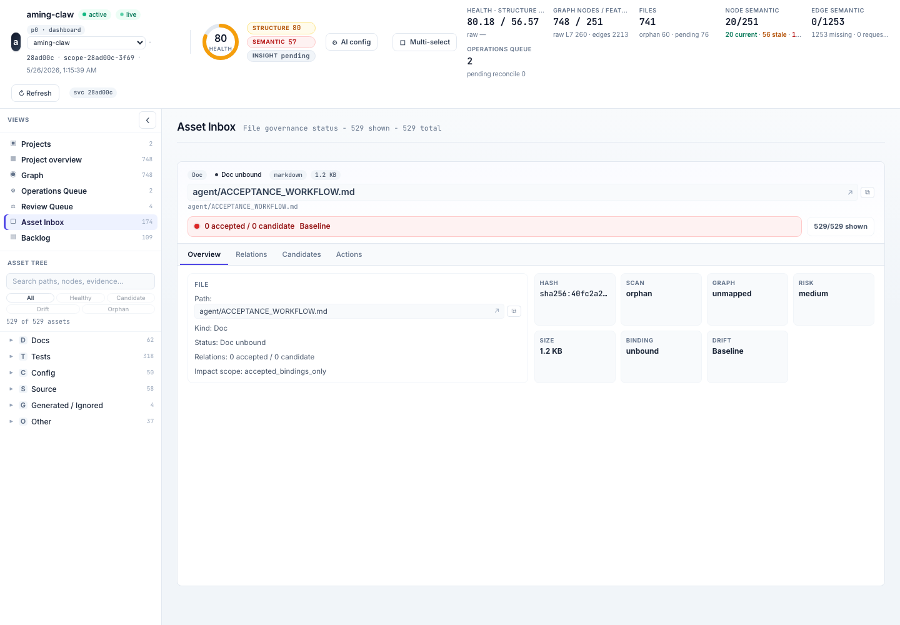
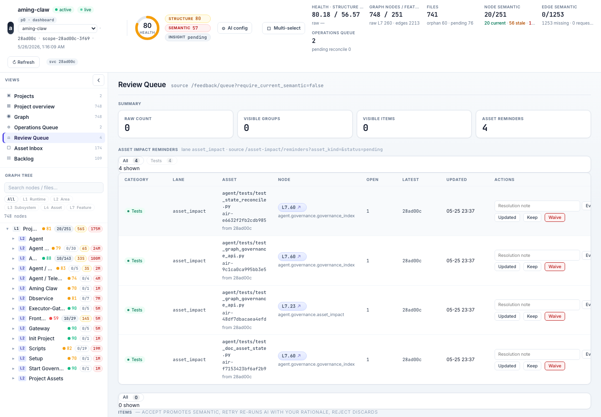

# Fear After Work

## Fear

The fear after work is that the agent leaves behind a patch and the project
forgets what happened. Docs may be unbound, tests may be stale, generated files
may look like source, and the next agent may reason from old graph memory.

## Demo

If you install the Aming Claw plugin, your current Claude Code or Codex session
is the observer. Ask it to run `/aming-claw:aming-claw-hn-challenge`; this
after-work case is the reconcile/review slice of that same control model. The
demo opens your local dashboard on the assets view and shows the post-change
hygiene path: Asset Inbox or file state for changed docs/tests/config assets and
Review Queue boundaries for reminders, proposals, and impact review before weak
evidence becomes trusted memory.

If you don't want to install anything yet, the "What you would see" section
below describes the flow without setup.

Expected dashboard pattern (opens locally after the skill runs):

```text
http://localhost:40000/dashboard?project_id=<project_id>&view=assets
```

Supporting pattern (opens locally after the skill runs):

```text
http://localhost:40000/dashboard?project_id=<project_id>&view=operations
http://localhost:40000/dashboard?project_id=<project_id>&view=review
```

## What you would see

The Asset Inbox shows changed docs, tests, config, and generated files as assets
with binding and drift state, not as automatically trusted project memory. The
Review Queue separates reminders, proposals, weak matches, and accepted
bindings, while Operations/Reconcile state shows whether the commit-bound graph
has caught up after merge. Stale docs or weak bindings become visible review
work instead of invisible AI debt.



*The Asset Inbox keeps changed docs, tests, and config visible until their
binding and drift state are reviewed.*



*The Review Queue keeps proposals and weak evidence separate from trusted
project memory.*

This answers the after-work fear by showing what changed after the patch lands
and what still needs review before the next agent can trust it.

## Evidence

*The visible evidence is what a human reviewer sees on the dashboard after
agents have shipped. The agents have already produced the change and the
reconcile candidates. The human reads asset state, accepts or rejects bindings,
and triggers reconcile when ready.*

The visible evidence is the post-work audit layer:

- Asset Inbox separates unbound docs/tests/config, weak candidates, accepted
  bindings, ignored assets, archives, and stale mapped files;
- weak AI or rule matches are proposals, not trusted graph state;
- reconcile updates commit-bound graph and semantic projections after source is
  committed;
- Manual Fix evidence records implementation and verification before close.

This case can run without live AI. AI proposals are optional; deterministic
asset state, reconcile status, and review gates are enough to show the control
plane.

## Why this works

Aming Claw separates source records from derived projections. Accepted bindings,
source-controlled hints, committed files, and review decisions are durable
inputs; Asset Inbox rows, graph snapshots, semantic projections, and operations
queue state are derived views. That separation lets the dashboard explain what
is trusted, what is only a candidate, and what must be reconciled before the
next agent treats it as project memory.

A changed doc first becomes a commit-bound asset with status and provenance. It
becomes graph impact scope only after a reviewed binding, not because an AI or
path heuristic guessed it belonged there.

## A real instance

During launch prep, `HN-FEAR-DEMO-SCREENSHOT-INDEX-20260526` caught that the HN
demo docs still pointed at stale screenshot filenames even though the browser
smoke was passing. The fix updated the README and case pages to match the actual
generated screenshot slots, then reran the HN browser smoke before closing the
row. The public source-visible audit is commit
`3ae68da8834cf24404c4d9672b2adaf02c19443e`, with a follow-up article link in
`70243f2dffe96c3a1bc5a9d6ed602ae6d236a60d`. That is the after-work problem in
miniature: the patch can work while reader-facing docs and evidence drift.

Related dogfood story:

[AI's tech debt is invisible - even to AI. I solved it at the architecture
layer.](https://dev.to/amingin_ai/ais-tech-debt-is-invisible-even-to-ai-i-solved-it-at-the-architecture-layer-1nh1)

That post is the architectural foundation of this fear: **the project graph must
be a deterministic projection of a commit, not a mutable memory blob**. Four
invariants -- fixed algorithm, 1:1 commit-snapshot binding, user-triggered
reconcile, stale-state prompt -- ensure that after AI work lands, the next agent
reasons from current truth, not from drifted memory. This case extends those
invariants from code-graph projection to docs, tests, config, weak bindings, and
review impact scope.

Architecture references:

- [After Work Architecture](../architecture/after-work-architecture.md)
- [Asset Inbox API Contract](../../api/asset-inbox-contract.md)
- [Reconcile Workflow](../../governance/reconcile-workflow.md)
- [Manual Fix SOP](../../governance/manual-fix-sop.md)
