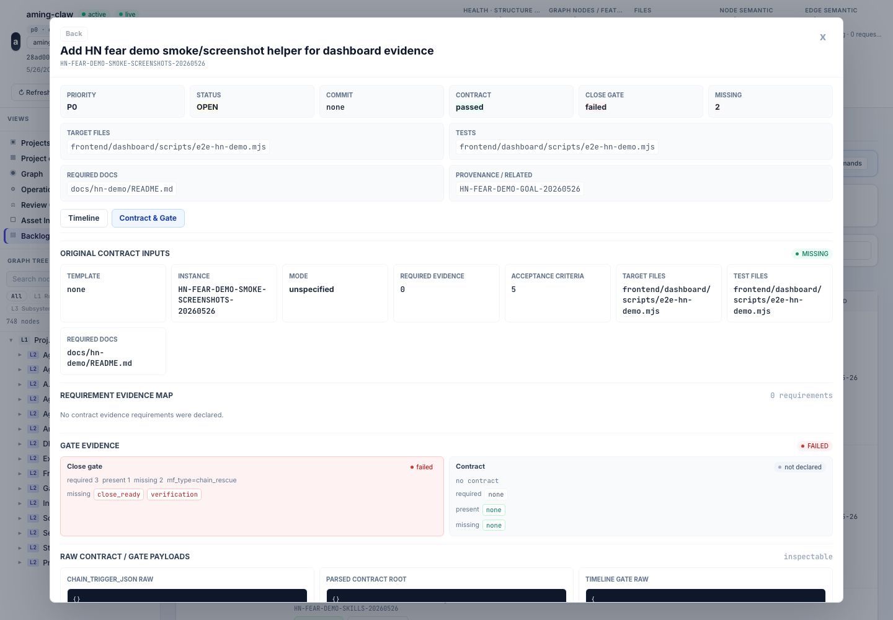
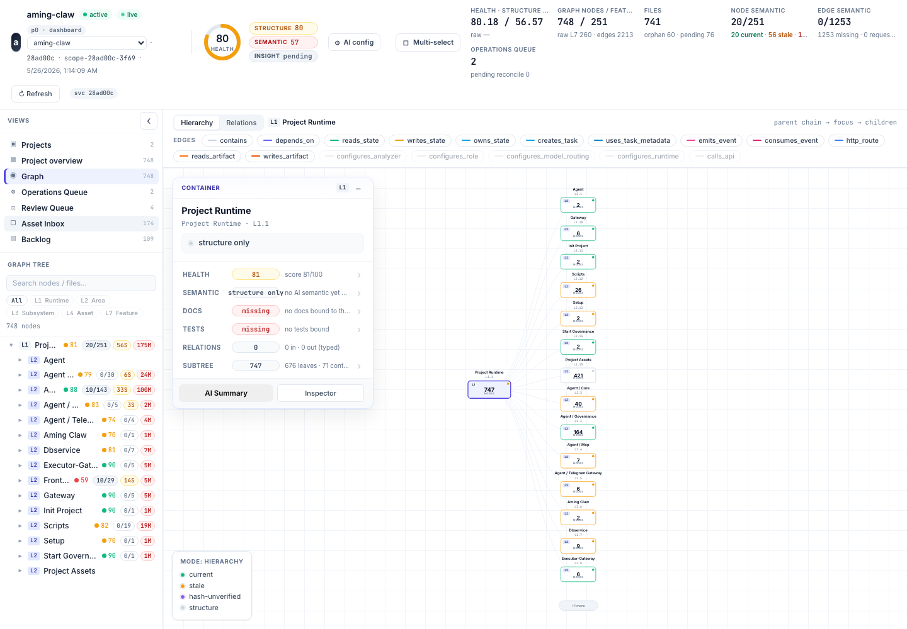

# Fear Before Work

## Fear

The common fear before an agent starts is that it will treat the repository as a
bag of text. It may edit a file that looks relevant, miss the real owner, skip
the test surface, or invent project structure from whatever happened to fit in
the prompt.

## Demo

If you install the Aming Claw plugin, your current Claude Code or Codex session
is the observer. Ask it to run `/aming-claw:aming-claw-hn-challenge`; this
before-work case is the graph/contract slice of that same control model. The
demo opens your local dashboard on the graph view, selects the target area, and
shows the backlog row, target files, and acceptance criteria before any
implementation work starts.

If you don't want to install anything yet, the "What you would see" section
below describes the flow without setup.

Expected dashboard pattern (opens locally after the skill runs):

```text
http://localhost:40000/dashboard?project_id=<project_id>&view=graph
```

## What you would see

The graph view shows the project structure the agent can inspect before it
edits: subsystem nodes, related files, and the selected target area. The backlog
row shows the requested work as a contract, with target files, required docs,
tests, provenance, and acceptance criteria visible before the first patch. For a
no-install reader, the important part is that the agent is not starting from a
chat prompt alone; it is starting from commit-bound project structure plus an
explicit work record.



*The backlog row names scope, docs, tests, provenance, and close-gate state
before implementation starts.*



*The graph view gives the agent project structure before it invents a new
pattern.*

This answers the before-work fear directly: the system can show what the agent
is allowed to see and what work it is authorized to attempt before any code is
changed.

## Evidence

*The visible evidence is what a human reviewer sees on the dashboard while the
agent is preparing to work. The agent is the operator -- it queries the graph,
reads the backlog, and asks for missing contract fields. The human reads what's
surfaced and decides whether the agent has enough context to start.*

The visible evidence is the project fact layer before editing:

- a commit-bound graph snapshot for the selected project;
- node/file/function/test/doc/config context where available;
- a backlog row that names the requested work, target files, and acceptance
  criteria;
- runtime and graph status that distinguish core governance readiness from
  optional chain or executor readiness.

This is skill-guided and deterministic where possible. The case does not need a
live AI model to prove the mechanism: the graph, backlog row, and dashboard
state are local governance records.

## Why this works

Aming Claw puts a project fact layer in front of the agent. The stable V1 flow
is graph-first, backlog-first, then scoped manual-fix work. The graph is tied to
a commit, so dirty workspace guesses do not become project truth. Backlog rows
record intent and acceptance criteria before mutation.

This case is not about finding text faster. It is about showing the agent the
existing ownership, peer modules, function surface, docs, tests, config, and
accepted project patterns before it invents a plausible new one.

## A real instance

The HN demo itself started from `HN-FEAR-DEMO-GOAL-20260526`, a backlog row that
named the three fear surfaces, required docs, target skills, screenshot helper,
and browser evidence before the demo docs and skills were finalized. That work
landed in commit `dcb0f1f350218e224222af890ef6e1c1c6300f1d`. The useful part for
this case is the ordering: the system recorded the intended surface and evidence
before the implementation changed the docs and demo skill files.

This case shares its commit with the during-work case because Aming Claw lands
concurrent backlog rows atomically. See
[One commit, many backlog rows](../article.md#one-commit-many-backlog-rows) in
the article for why.

Related dogfood story:

[AI proposed 5 components for my parallel system. After walking one scenario,
only 3 were real.](https://dev.to/amingin_ai/ai-proposed-5-components-for-my-parallel-system-after-walking-one-scenario-only-3-were-real-12nd)

That post articulated the underlying principle: **AI optimizes for plausibility,
not necessity**. A plausible architecture isn't enough until a concrete scenario
walks through it and surfaces what's actually load-bearing -- and what AI missed
entirely. The scenario-walk method described there is the human-side discipline
that this case enforces structurally through the graph and contract.

Architecture references:

- [Before Work Architecture](../architecture/before-work-architecture.md)
- [System Architecture](../../architecture.md)
- [Manual Fix SOP](../../governance/manual-fix-sop.md)
