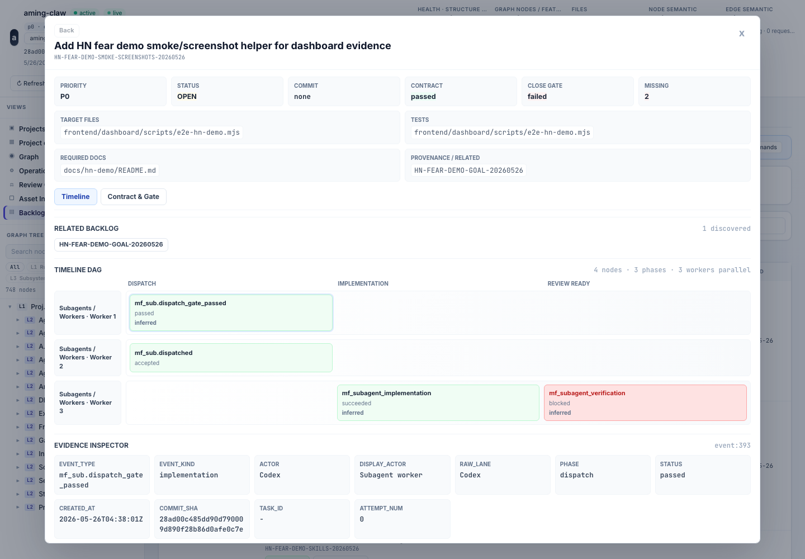

# Fear During Work

## Fear

The fear during work is that multiple agents will collide in the same checkout,
overwrite each other, or produce changes that cannot be reviewed in a sensible
order. Even a good single-agent patch becomes risky if the system cannot say
which branch, worktree, fence token, tests, and merge gate it belongs to.

## Demo

If you install the Aming Claw plugin, your current Claude Code or Codex session
is the observer. Ask it to run `/aming-claw:aming-claw-hn-challenge`; this
during-work case is the worker-lane/replay slice of that same control model.
The demo opens your local dashboard on the backlog item view and shows a
manual-fix or subagent work item with an observer lane plus at least two bounded
worker lanes. The dashboard shows disjoint ownership, dispatch, implementation,
verification, close-ready state, actors, target files, and any inferred or
blocked checkpoints.

If you don't want to install anything yet, the "What you would see" section
below describes the flow without setup.

Expected dashboard pattern (opens locally after the skill runs):

```text
http://localhost:40000/dashboard?project_id=<project_id>&view=backlog&backlog=<backlog_id>
```

## What you would see

The backlog modal shows a timeline DAG for one work item, grouped by phase
columns and lanes: observer plus two or more workers. The current launch demo is
replay-shaped: Worker A passes, Worker B fails or is interrupted, and the
observer dispatches a replay attempt for B from the same contract evidence. The
bundled screenshot shows three worker lanes, which is more than the minimum
needed to prove the control. Timeline cards expose dispatch, implementation,
failure, replay, verification, and review-ready checkpoints, while the evidence
inspector shows actor, phase, status, commit, task id, attempt number, and trace
metadata for the selected node. The point is not that the agent wrote a
confident final answer; the point is that each worker's work is attached to lane
structure, phase transitions, replay linkage, and evidence records.


*The timeline makes observer and worker lanes, phases, and blocked checkpoints
visible for review. This screenshot shows three worker lanes; two is the
smallest useful parallel demo.*



*Selecting a timeline node shows the evidence fields behind the visible card.*

This answers the during-work fear by making execution reviewable while agents
are still working, before a merge or close decision can hide the path they took.

## Evidence

*The visible evidence is what a human reviewer sees on the dashboard while
agents are executing. The agents are the operators -- they implement, verify, and
post evidence to the timeline. The human reads the lane structure and intervenes
at gate boundaries.*

The visible evidence is not "the agent said it was careful." It is durable
coordination state:

- a manual-fix backlog row with target files and acceptance criteria;
- timeline lanes that separate observer and per-worker actions;
- two or more worker scopes with disjoint `owned_files`;
- per-worker fence tokens and graph-query trace ids that resolve in the audit
  ledger;
- dispatch, implementation, failed/interrupted attempt, replay, verification,
  and close-ready checkpoints;
- evidence inspector details that show actor, phase, status, and artifacts.
- attempt metadata showing that a replay is tied to the same contract lineage
  instead of being an unstructured "try again" chat message.

The fixture can bootstrap a small demo project, but the during-work evidence
should come from real observer-mode MCP/governance calls. Do not present a
single-worker fixture replay as the parallel demo.

## Why this works

Manual Fix keeps implementation bounded when the V1 chain is not the right tool
for the job. The parallel multibranch design extends that discipline to
multiple workers: branch-local evidence is candidate evidence, target graph truth
changes only after ordered merge and target reconcile, and stale fences are
rejected instead of trusted.

Two workers are enough to make the architecture visible: if Worker A and Worker
B have separate owned files, fence tokens, trace ids, and lane events, the human
reviewer can audit concurrency without running either implementation manually.
The replay case adds the missing edge: when Worker B fails, the observer can
dispatch attempt 2 from the same contract evidence, with a new fence and new
trace ids, instead of relying on chat memory. The current screenshot uses three
workers because it was generated from a richer demo row; the architectural point
is the same.

The important boundary is that the worker does not accept its own work. Dispatch,
implementation, verification, merge readiness, and backlog close are separate
state transitions. The contract, source head, dirty scope, and evidence timeline
make those transitions reviewable.

Observer mode also protects the developer's thinking time. The human can keep
discussing requirements and review boundaries while the agent turns them into
contracts and dispatches bounded workers in parallel.

The graph boundary is one-hop: branch/worktree graph artifacts are candidate
evidence against the target commit, not canonical project memory. Only the
target ref graph advances after ordered merge and target reconcile.

## A real instance

`HN-BACKLOG-TIMELINE-LANE-READABILITY-20260526` was filed when the backlog
timeline needed to make observer and subagent execution readable instead of
showing raw IDs as the primary lane names. It required human-readable lane
grouping, kept raw audit ids available in the evidence inspector, and landed
with the HN demo evidence work in commit
`dcb0f1f350218e224222af890ef6e1c1c6300f1d`. Parallel agent work is not
reviewable unless the lanes and evidence survive the UI.

The repeatable launch sandbox now creates a second real instance for this case:
one worker passes, another worker records a failed or interrupted attempt, and a
replay attempt passes with its own graph trace and fence token. That makes the
case sharper than a happy-path parallel timeline because the audit surface has
to preserve attempt history, not just final success.

The screenshot attached to this case shows the general shape: one observer lane,
three worker lanes, five phases, and six timeline nodes. The replay sandbox adds
the failure/retry edge that a static screenshot cannot fully explain: worker
count and attempt history are not hidden in prose; they are visible in the
review surface and audit report.

This case shares its commit with the before-work case because Aming Claw lands
concurrent backlog rows atomically. See
[One commit, many backlog rows](../article.md#one-commit-many-backlog-rows) in
the article for why.

Related dogfood story:

[I told my AI to build a feature. Did it? I had no
idea.](https://dev.to/amingin_ai/i-told-my-ai-to-build-a-feature-did-it-i-had-no-idea-1f1)

That post solved an upstream piece of this fear: **markdown is dead text, the
backlog database is live state**. A task isn't done because the agent says so --
it's done when the state machine transitions to `done(commit hash)` with the
commit automatically bound. That binding is what makes during-work evidence
reviewable, and what this case extends into multi-agent territory with worktree
fences and observer gates.

Architecture references:

- [During Work Architecture](../architecture/during-work-architecture.md)
- [Manual Fix SOP](../../governance/manual-fix-sop.md)
